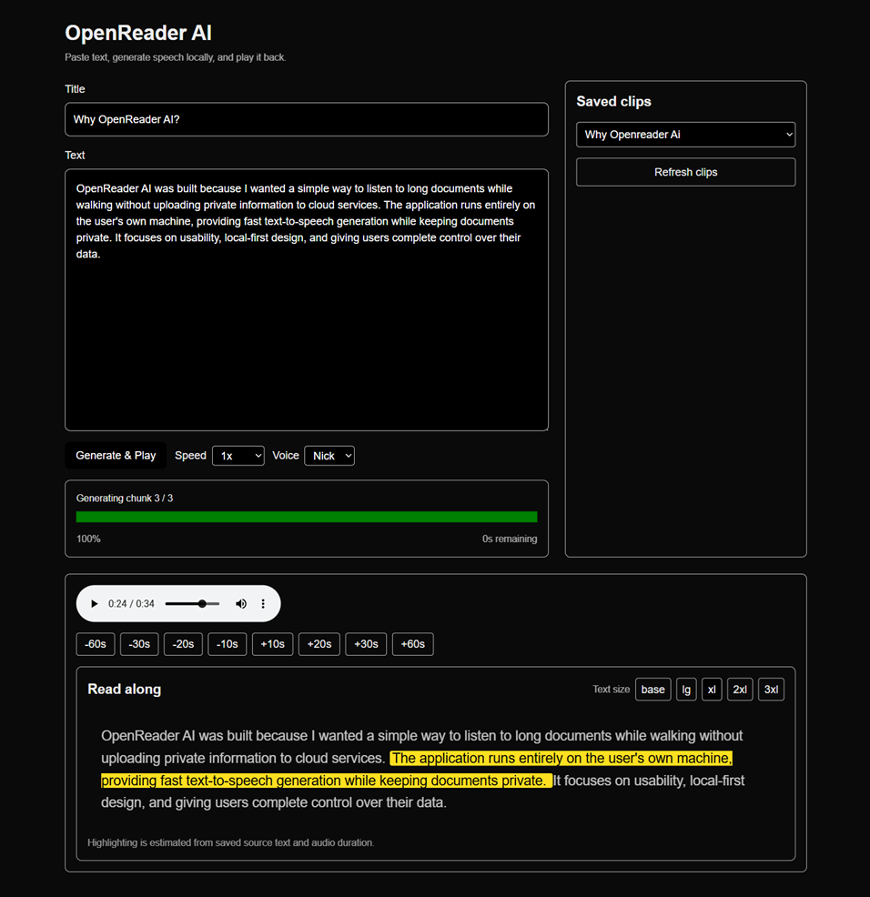

# OpenReader AI

> A privacy-first local AI text-to-speech reader that converts long-form text into natural speech while keeping every document on your own machine.



OpenReader AI is a full-stack application that combines a modern React frontend with a local AI backend to provide an offline alternative to cloud-based text-to-speech services. It was designed for listening to technical documentation, research papers, books, and long articles while walking, driving, or exercising.

Unlike many commercial solutions, OpenReader AI never uploads your documents to external servers. All text processing and speech generation happen locally, giving users complete control over their data.

---

## Features

- 🎤 Fully local AI text-to-speech generation
- 🔒 Privacy-first architecture (no cloud APIs)
- 📄 Long-document support with automatic chunking
- 📚 Read-along mode with synchronized sentence highlighting
- ⏯ Rich playback controls
  - Skip backward / forward
  - Playback speed adjustment
  - Audio scrubbing
- 🗂 Saved recordings library
- 🎙 Multiple narrator support
- 📊 Live generation progress and ETA
- ⚡ Persistent AI model loaded once at startup
- 🚀 GPU acceleration with CUDA

---

## Screenshot


---

## Why I Built It

I frequently listen to technical documentation, AI course material, and long-form articles while walking.

Most text-to-speech platforms either require uploading documents to cloud services or charge recurring subscription fees.

OpenReader AI was built to provide a fast, offline alternative that gives users complete ownership of their documents while still offering a polished reading experience.

---

## Tech Stack

### Frontend

- React
- Next.js (App Router)
- TypeScript
- Tailwind CSS

### Backend

- FastAPI

### AI

- XTTS v2
- PyTorch
- Torchaudio

### Infrastructure

- NVIDIA CUDA

---

## Architecture

```text
                +----------------------+
                |   Next.js Frontend   |
                +----------+-----------+
                           |
                     HTTP / REST API
                           |
                           ▼
                +----------------------+
                |     FastAPI Server   |
                +----------+-----------+
                           |
                      Job Queue
                           |
                           ▼
                    XTTS v2 Model
                           |
             +-------------+--------------+
             |                            |
             ▼                            ▼
        Audio (.wav)              Timing Metadata
             |                            |
             +-------------+--------------+
                           |
                           ▼
                 Read-Along Player
```

---

## Technical Highlights

- Full-stack React + FastAPI application
- Asynchronous job queue for long-running AI inference
- Automatic chunking of long documents
- Sentence-level timing metadata for synchronized highlighting
- Persistent GPU model loading to minimize latency
- Local-first architecture with no external AI services

---

## Future Enhancements

- MP3 export
- Audiobook playlists
- Chapter navigation
- Bookmarks
- Search within transcripts
- Improved timing precision
- Additional voice management tools

---

## License

MIT
